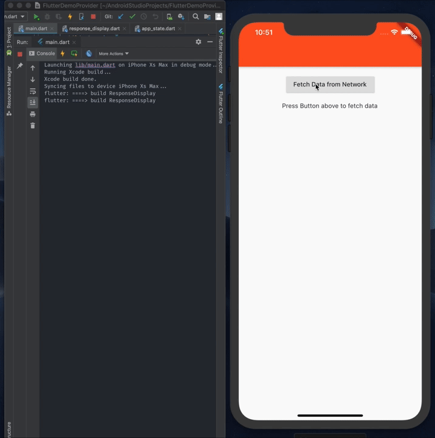

# Example of flutter state management with provider

Only changed item will render :) 

Resources:
* [Provider Flutter Package][0]
* [Pragmatic State Management in Flutter (Google I/O'19)][1]

[0]: https://pub.dev/packages/provider
[1]: https://www.youtube.com/watch?v=d_m5csmrf7I&t=1220s
